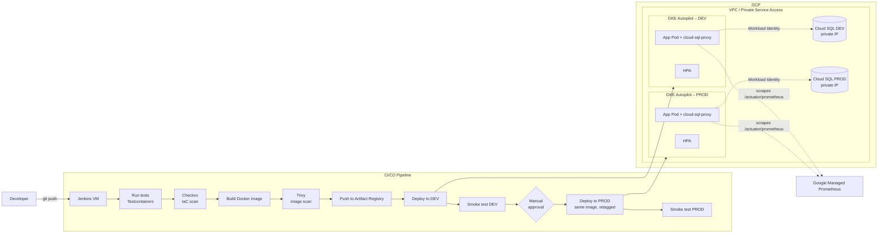

# GCP Java GKE CI/CD

A small end-to-end DevOps showcase project: a containerized Spring Boot (Java 21) shop API, provisioned on **Google Kubernetes Engine (Autopilot)** with **Terraform**, deployed across two environments through a **Jenkins CI/CD pipeline**, and secured with IaC/image scanning, Workload Identity, and a private Cloud SQL database.

The goal of this repository is to demonstrate a realistic, minimal-but-complete DevOps workflow: Infrastructure as Code → containerization → automated build/test/scan/deploy → promotion between environments → runtime observability.

---

## Architecture



**Flow summary:**
1. Infrastructure (Artifact Registry, GKE Autopilot cluster, Cloud SQL, IAM, Jenkins VM) is provisioned per environment via Terraform, with remote state in a GCS bucket.
2. Every pipeline run: run unit/integration tests → scan the Terraform/Kubernetes code with Checkov → build the Docker image → scan it with Trivy → push to Artifact Registry → deploy to DEV → run a smoke test against the live `/actuator/health` and `/api/products` endpoints.
3. After a manual approval step, the exact same image is retagged and promoted to PROD, then smoke-tested again.
4. The app exposes Prometheus-compatible metrics via Actuator, scraped natively by Google Managed Prometheus — no Prometheus Operator to install or maintain.
5. An HPA scales each deployment based on CPU utilization; a `cloud-sql-proxy` sidecar handles the private connection to Cloud SQL through Workload Identity.

---

## Tech stack

| Layer | Technology |
|---|---|
| Application | Java 21, Spring Boot 4, Spring Data JPA, Flyway, Bean Validation |
| Testing | JUnit 5, Testcontainers, Mockito |
| Containerization | Docker (multi-stage build) |
| Infrastructure | Terraform, Google Cloud (VPC, GKE Autopilot, Cloud SQL, Artifact Registry, IAM) |
| Orchestration | Kubernetes (Deployment, Service, Ingress, HPA, ConfigMap), Kustomize |
| CI/CD | Jenkins (Declarative Pipeline) |
| Security | Checkov (IaC scanning), Trivy (image scanning), Workload Identity |
| Monitoring | Google Managed Prometheus (`PodMonitoring`, `/actuator/prometheus`) |
| Registry | Google Artifact Registry |

---

## Repository structure

```
.
├── java-shop/
│   ├── src/main/java/...   # Application code (product, order, health, exception)
│   ├── src/test/java/...   # Unit + integration tests (Testcontainers)
│   ├── Dockerfile           # Multi-stage build (JDK -> JRE)
│   └── docker-compose.yml   # Local dev environment (app + Postgres)
├── terraform/
│   ├── bootstrap/            # GCS bucket for remote state (run once)
│   ├── modules/               # gke, cloud-sql, iam, artifact-registry,
│   │                          # jenkins-vm, private-service-access
│   └── environments/
│       ├── dev/
│       └── prod/
├── k8s/
│   ├── base/                  # Deployment, Service, Ingress, HPA, ConfigMap,
│   │                          # ServiceAccount, PodMonitoring, BackendConfig
│   └── overlays/
│       ├── dev/                 # 1 replica, smaller resources
│       └── prod/                # 2 replicas, larger resources
└── Jenkinsfile                 # Test, scan, build, deploy, promote, smoke test
```

---

## Getting started

### Prerequisites
- A GCP project with billing enabled
- `terraform` >= 1.6.0
- `gcloud` CLI, authenticated (`gcloud auth login`)
- `kubectl`, `docker`
- A Jenkins instance with `docker`, `gcloud`, and `kubectl` available on the agent

### 1. Enable required GCP APIs
```bash
gcloud services enable container.googleapis.com sqladmin.googleapis.com \
  artifactregistry.googleapis.com servicenetworking.googleapis.com
```

### 2. Bootstrap remote state
```bash
cd terraform/bootstrap
terraform init
terraform apply -var="project_id=<YOUR_PROJECT_ID>"
```

### 3. Provision the infrastructure
```bash
cd ../environments/dev
terraform init
terraform apply \
  -var="project_id=<YOUR_PROJECT_ID>" \
  -var="project_number=<YOUR_PROJECT_NUMBER>" \
  -var="region=europe-central2" \
  -var="zone=europe-central2-a" \
  -var="database_password=<PASSWORD>" \
  -var="allowed_ssh_cidr=<YOUR_IP>/32" \
  -var="allowed_jenkins_cidr=<YOUR_IP>/32"
```
This creates the GKE Autopilot cluster, a private Cloud SQL instance, the Artifact Registry repository, IAM service accounts, and the Jenkins VM. `prod` is provisioned the same way from `terraform/environments/prod` (it reuses the same Jenkins instance).

### 4. Configure the Jenkins pipeline
Point a Jenkins Declarative Pipeline job at the `Jenkinsfile` in this repo. The agent needs `gcloud` authenticated against the service accounts created in step 3 (via metadata-server credentials on the Jenkins VM — no long-lived keys required).

### 5. Deploy
Trigger the pipeline — it will run tests, scan the code and the image, push to Artifact Registry, deploy to DEV, smoke-test it, wait for manual approval, then promote the same image to PROD.

### 6. (Optional) run locally
```bash
cd java-shop
docker compose up -d
curl http://localhost:8080/actuator/health
```

---

## Design decisions & known limitations

This project intentionally favors clarity to stay readable as a portfolio piece. A few trade-offs, made explicit rather than hidden:

- **Remote Terraform state** is used (GCS backend, one prefix per environment), but state locking relies on the default GCS mechanism rather than a dedicated lock table — fine for a single contributor, worth revisiting for a team setup.
- **GKE Autopilot** was chosen over Standard mode to reduce operational surface (node pools, upgrades) at the expense of some low-level control (e.g. no custom DaemonSets).
- **The default VPC** is used rather than a dedicated one — a deliberate simplification for a demo; a production setup would use a custom VPC with a private cluster.
- **The Jenkins VM's service account** has a broad `cloud-platform` OAuth scope, while more narrowly-scoped IAM roles are also defined per environment. In a production setup, the scope would be trimmed to match the roles actually needed.
- **Checkov runs in soft-fail mode** — it reports findings but doesn't block the pipeline yet. The natural next step is turning it into a hard gate once the baseline findings are triaged.
- **Image promotion is tag-based** (`dev-<build>` → `prod-<build>` via `docker tag`), not digest-based. This keeps the pipeline readable, though promoting by digest would remove any theoretical ambiguity between what was tested and what is deployed.
- **No TLS on the Ingress** — traffic is plain HTTP for the demo; a managed certificate would be the next step.
- No GitOps layer (Argo CD/Flux) — deployments are pushed imperatively from Jenkins via `kubectl apply`.

## Skills demonstrated

Infrastructure as Code (Terraform, modules, multi-environment) · Kubernetes (GKE Autopilot, Kustomize, HPA, Workload Identity) · CI/CD automation (Jenkins, multi-stage pipelines, approval gates, rollback) · containerization (Docker multi-stage builds) · automated testing (JUnit, Testcontainers) · security scanning (Checkov, Trivy) · observability (Prometheus via Spring Boot Actuator/Micrometer) · GCP networking & IAM (private services access, service accounts, least-privilege roles).
