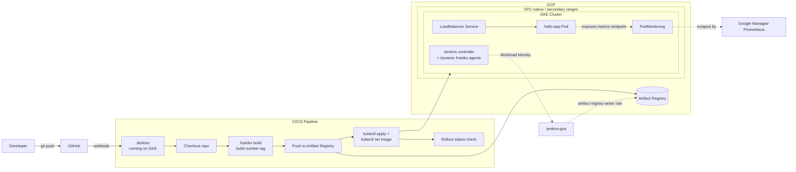

# GCP Jenkins Terraform

An end-to-end CI/CD platform showcase: **Jenkins running inside GKE itself** (installed via Helm), building container images with **Kaniko** (no Docker daemon, no privileged containers), and deploying a small Python (Flask) app through a Kubernetes-native pipeline — all provisioned by modular Terraform with a real Workload Identity setup.

This is the most "platform-style" project in the series: instead of a Jenkins VM sitting next to the cluster, Jenkins *is* a workload on the cluster, authenticating to GCP without a single static credential.

---

## Architecture



**Flow summary:**
1. Terraform provisions a dedicated VPC-native network, a GKE cluster with Workload Identity enabled, an Artifact Registry repository, and the IAM bindings tying the `jenkins` Kubernetes Service Account to a Google Service Account (`jenkins-gsa`).
2. Jenkins itself runs on the cluster (Helm chart), and every pipeline run spins up an ephemeral pod with a **Kaniko** container to build the image and a `kubectl` container to deploy it — no Docker socket is ever mounted.
3. Kaniko builds and pushes the image to Artifact Registry, authenticating purely through Workload Identity.
4. The pipeline applies the Kubernetes manifests (`Service`, `Deployment`, `PodMonitoring`), updates the deployment's image, and blocks on `kubectl rollout status` for a pass/fail signal.
5. The app exposes Prometheus metrics at `/metrics`, scraped natively by Google Managed Prometheus via `PodMonitoring` — no Prometheus Operator to install.

---

## Tech stack

| Layer | Technology |
|---|---|
| Application | Python 3.11, Flask, `prometheus_client`, Gunicorn |
| Image build | Kaniko (daemonless, in-cluster builds) |
| Infrastructure | Terraform (modules + dev environment), Google Cloud (VPC-native network, GKE, Artifact Registry, IAM) |
| Orchestration | Kubernetes (Namespace, Deployment, Service, RBAC, PodMonitoring) |
| CI/CD | Jenkins (installed via Helm, running inside GKE, Kubernetes pod agents) |
| Authentication | Workload Identity (KSA `jenkins/jenkins` → GSA `jenkins-gsa`) |
| Monitoring | Google Managed Prometheus (`PodMonitoring`, `/metrics`) |
| Registry | Google Artifact Registry |

---

## Repository structure

```
.
├── apps/
│   ├── app.py                # Flask app (/, /health, /metrics)
│   ├── Dockerfile
│   └── requirements.txt
├── jenkins/
│   ├── values.yaml            # Helm values for the Jenkins controller
│   └── jenkins-rbac.yaml      # ServiceAccount, Role, RoleBinding for Jenkins
├── k8s/
│   ├── namespace.yaml          # "demo" namespace
│   ├── deployment.yaml          # readiness + liveness probes
│   ├── service.yaml              # LoadBalancer Service
│   └── podmonitoring.yaml        # Google Managed Prometheus scrape config
├── terraform/
│   ├── modules/
│   │   ├── network/               # VPC + subnet with secondary ranges
│   │   ├── iam/                   # terraform-sa, jenkins-gsa, Workload Identity binding
│   │   ├── gke/                   # VPC-native cluster + dedicated node pool
│   │   └── artifact_registry/
│   └── environments/
│       └── dev/
└── Jenkinsfile                    # Kubernetes-agent pipeline: Kaniko build → deploy → verify
```

---

## Getting started

### Prerequisites
- A GCP project with billing enabled
- `terraform` >= 1.5.0
- `gcloud` CLI, authenticated (`gcloud auth login`)
- `kubectl`, `helm`

### 1. Enable required GCP APIs
```bash
gcloud services enable container.googleapis.com artifactregistry.googleapis.com \
  compute.googleapis.com iam.googleapis.com
```

### 2. Provision the infrastructure
```bash
cd terraform/environments/dev
terraform init
terraform apply \
  -var="project_id=<YOUR_PROJECT_ID>" \
  -var="region=europe-west1" \
  -var="zone=europe-west1-b" \
  -var="artifact_registry_repo_name=demo-repo" \
  -var="cluster_name=demo-gke" \
  -var="gke_node_count=2" \
  -var="gke_machine_type=e2-medium" \
  -var="gke_disk_size_gb=30"
```
This creates the VPC-native network, the GKE cluster and node pool, the Artifact Registry repository, and the `jenkins-gsa` service account bound to `roles/artifactregistry.writer` via Workload Identity.

### 3. Install Jenkins on the cluster
```bash
kubectl apply -f jenkins/jenkins-rbac.yaml

helm repo add jenkins https://charts.jenkins.io
helm repo update

helm install jenkins jenkins/jenkins \
  -n jenkins --create-namespace \
  -f jenkins/values.yaml
```
> Before installing, replace the default admin credentials and the hardcoded `iam.gke.io/gcp-service-account` project ID in `jenkins/values.yaml` with your own — see [Design decisions & known limitations](#design-decisions--known-limitations) below.

### 4. Configure the pipeline
Point a Jenkins Pipeline job at the `Jenkinsfile` in this repo (a GitHub webhook can trigger it automatically on push). Update `PROJECT_ID` in the `environment` block to match your project.

### 5. Deploy and verify
```bash
kubectl get svc hello-app -n demo
curl http://<LOADBALANCER_IP>/health
curl http://<LOADBALANCER_IP>/metrics
```

---

## Design decisions & known limitations

This project focuses on showing a Kubernetes-native CI/CD platform (Jenkins-on-GKE, daemonless builds, Workload Identity) rather than a hardened production deployment. Trade-offs made explicit rather than hidden:

- ⚠️ **`jenkins/values.yaml` ships a hardcoded default admin password and exposes the Jenkins controller via a public `LoadBalancer`.** This is fine to get the chart running locally for a demo, but must never be used as-is: set a real admin password through a Kubernetes Secret / Jenkins Configuration-as-Code, and put the controller behind `ClusterIP` + port-forward or an authenticated Ingress instead of a public IP.
- **The GKE node pool reuses `terraform-sa`** (the Terraform provisioning service account, which holds project-level admin roles) as its node service account, instead of a dedicated, minimally-scoped SA. Nodes should run with just the permissions they actually need (typically just log/metric writer + Artifact Registry reader).
- **Workload Identity is only wired for Jenkins**, not for the application pods — `hello-app` doesn't currently need GCP APIs, but if it ever does, it would need its own KSA→GSA binding rather than inheriting the node's identity.
- **No image or IaC scanning** in the pipeline (no Trivy/Checkov) — Kaniko builds and pushes without a vulnerability gate.
- **Single environment (`dev`)** — no staging/production split or promotion flow.
- **No HPA or resource requests/limits** on the application deployment.
- **No TLS** on the app's `LoadBalancer` Service.

## Skills demonstrated

Infrastructure as Code (Terraform, modular, VPC-native networking) · Kubernetes-native CI/CD (Jenkins on GKE, dynamic pod agents) · daemonless container builds (Kaniko) · secure cloud authentication (Workload Identity, scoped IAM roles) · Kubernetes RBAC · observability (Prometheus metrics via `PodMonitoring` / Google Managed Prometheus) · debugging real platform issues (RBAC permission errors, Artifact Registry auth failures, service account misconfiguration).
